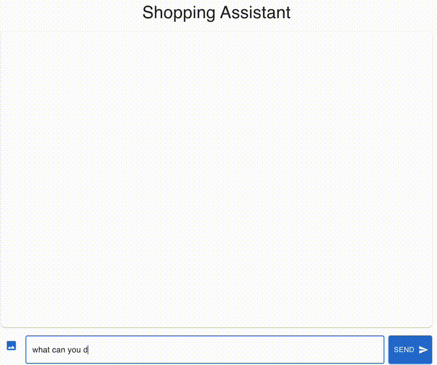

# Shopping Assistant Agent

## Overview
A simple agent to deliver a delightful AI assisted shopping experience for your ecommerce site.

## Setup
Backend
- run `pip install -r requirements`
- create a `.env` file in project folder
- provide OpenAI API key in `.env` file as `OPENAI_API_KEY=<api-key>`
- run `fastapi run api.py`

Frontend
- cd /frontend
- run `npm install`
- run `npm run build`
- run `npm start`

## Technical Architecture

This shopping agent essentially implements a RAG system for an ecommerce site's
product catalog. To answer a user's prompt, the agent fetches relevant product information
from a vector DB and sends the enriched context to LLM to generate the final response.

* Shopping Agent: The shopping agent is accessible via a REST API and encapsulates the core
chatbot logic to handle user prompts. Each /chat API call returns a response from the agent.
* Product Semantic Search: Product catalog is converted into embeddings to support semantic search,
and product images and product text descriptions are
turned into two separate embedding collections to support both image and text queries.
* Product Info Retrieval: Vector DB returns the closest matched product ID for a given query,
and the full product info is fetched from SQL DB and 
returned back to the shopping agent. The shopping agent then includes the product info
in the prompt context window for LLM to generate the final response to the user.
* Agent flow coordination: The interactions between the agent and the vector DB are facilitated by
LLM tool calling. Whether and when to perform a semantic search is entirely determined by LLM
based on the user prompt.

## Technical Decisions
* DB Choice: Chroma DB is the chosen vector DB for its simplicity and ease of use. It supports both
text and image embedding as well as metadata associated with each embedding, which enables
the mapping between embeddings and external data sources. Sqlite is the chosen SQL DB to store product
catalog information, again mainly for its simplicity. For small/personal ecommerce sites, this
solution will enable quick development, but for large ecommerce sites with large product catalog or 
high visitor traffic, LanceDB and MySQL should be considered as a more scalable replacement. And
more data preprocessing, such as embedding indexing and clustering, may be required for larger systems.
* Semantic Search: Currently, only the top one most similar item with the query is returned.
The retrieval process can be expanded and fine-tuned to achieve better
results, such as metadata filtering and result reranking. 
* LLM Interactions: 
Instead of hand writing the workflows of the product search experience, LLM is in full charge to coordinate between
data sources and processing steps via tool calling. LLM is instructed to use json formatted response for better 
programmability. A small note is that when image data is involved in the LLM prompt, it's observed that LLM currently does not always send
the exact image data (e.g., base64 encoded) back for tool calling purposes. Thus, only image ID is passed back and forth
between LLM and the agent and the image data is referenced locally by the image ID.